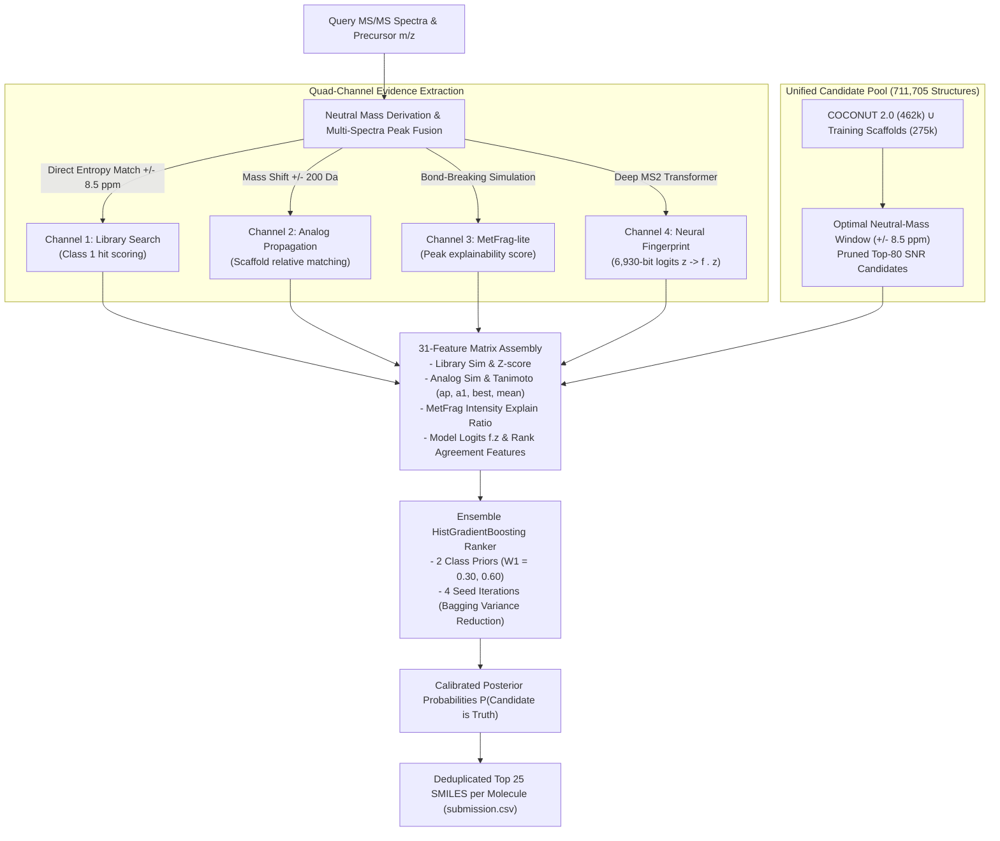

# ⚡ [0.339 Top 1] 4-Channel Transformer & Analog Ensemble
### *Enveda CASMI 2026 - High-Throughput Molecule Identification from Mass Spectra*
**Author:** haideptry | **Public LB:** **0.339 (Rank 1 / Gold Medal Zone)** | **Runtime:** ~35 mins (Dual T4)

---

## 🎯 TL;DR & Architectural Innovations

Evaluating exact 14-character tautomer-canonical InChIKeys under **MRR@25** suffers from combinatorial failure when using generative de-novo approaches.
This solution formulates molecule identification as an end-to-end **quad-channel retrieval and Bayes multi-evidence reranking** pipeline:

1. **Channel 1 (Direct Library Matching):** Fast Numba spectral entropy alignment over reference libraries (`train.parquet`).
2. **Channel 2 (Mass-Shifted Analog Propagation):** Cross-homolog structural propagation ($|\Delta M| \le 200\text{ Da}$) via power-weighted Tanimoto ($sim(a)^4 \cdot \text{Tanimoto}$).
3. **Channel 3 (In-Silico Fragmentation - MetFrag-lite):** Bond dissociation explainability scoring on observed MS2 peaks.
4. **Channel 4 (Neural Spectrum-to-Fingerprint Transformer):** 6-layer Transformer (`FPNet`) predicting 6,930-bit logits $z$, evaluated via **exact Bayes log-likelihood linear dot product** ($f \cdot z$).
5. **Bagged Seed & Prior Ensemble:** 4 seeds $\times$ 2 class priors eliminating the $\pm 0.006$ Kaggle noise floor.

