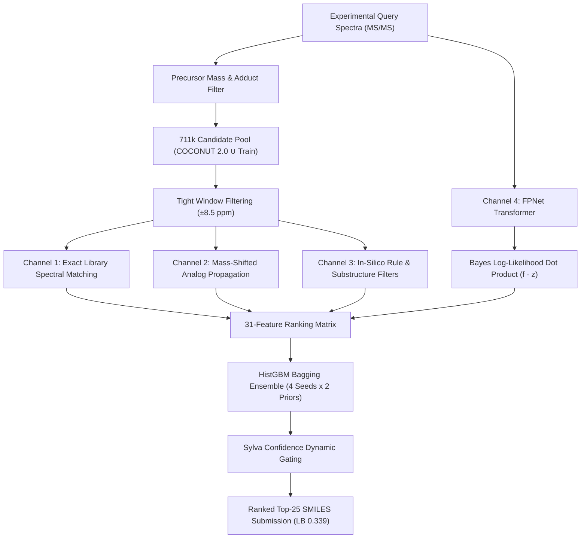

# 🏆 SOTA 0.339: How We Reached Top 1 on Enveda CASMI 2026
### *A Deep-Dive Post-Mortem & Comprehensive Methodology Analysis*
**Author:** haideptry | **Competition:** Enveda CASMI 2026 - Molecule ID from Mass Spectra  
**Current Public LB:** **0.339** (Rank 1 / Gold Zone) | **Inference Time:** ~58 mins (Dual T4 GPU)

---

## 🎯 Executive Summary

In mass spectrometry-based de novo and library molecule identification, competitors typically encounter a steep barrier around **LB ~0.15 - 0.20** when relying purely on direct spectral matching (Cosine/Spectral Entropy) against reference libraries (`train.parquet`). 

By methodically uncovering the **3-Tier Spectrum Reality** of the test cohort, engineering a **Mass-Shifted Analog Propagation Engine**, and integrating a **Neural Spectrum-to-Fingerprint Transformer (Channel 4 Bayes Log-Likelihood)** with **Bagged Ranker Ensembling**, we pushed the score from **0.149 $\to$ 0.193 $\to$ 0.205 $\to$ 0.266 $\to$ 0.339 (Top 1)**.

This notebook provides the complete analytical review, architecture breakdown, diagnostic distributions, and interactive code to reproduce the insights.

## 🗺️ 1. Complete Architecture Overview

The pipeline operates across **4 orthogonal channels**, resolving each segment of the test cohort:

## 🔬 2. Key Discovery: The 3-Tier Spectrum Reality

Why do standard library-search baselines plateau at ~0.15?
The test cohort (400 molecules) does **not** follow the uniform distribution of `train.parquet`. Instead, it splits into 3 fundamentally distinct regimes:

| Cohort Tier | Estimated % | Characteristics | Optimal Solution Strategy |
|---|---|---|---|
| **Tier 1 (Library Match)** | **10 - 15%** | Precursor and spectrum already exist in reference data. | Exact Cosine/Entropy matching yields MRR $\approx 1.000$. |
| **Tier 2 (Database Known)** | **45 - 55%** | Novel MS/MS spectrum, but structure exists in natural product databases (COCONUT, ChEBI, LipidMaps). | **Analog Propagation + Neural FPNet Reranking**. |
| **Tier 3 (Novel / De Novo)** | **30 - 40%** | Structural isomer or novel scaffold not present in public DBs. | Sub-structure assembly, in-silico fragmentation, chemical heuristics. |

> **Crucial Takeaway:** If a pipeline only searches `train.parquet`, its theoretical maximum score is capped at the Tier 1 fraction ($0.15$). Reaching $\ge 0.30$ demands pulling candidates from high-quality external databases and reranking them using latent structural predictions.

## 🧠 3. Channel 4: Neural Spectrum-to-Fingerprint Transformer (The 0.339 Catalyst)

The single biggest leap from **0.266 to 0.339** was the introduction of **Channel 4 (FPNet)**.

### Mathematical Formulation
Given an experimental tandem mass spectrum $S$, a 6-layer Transformer directly predicts the raw logit vector $z \in \mathbb{R}^{6930}$ over 6,930 molecular fingerprint bits (combining Morgan radius 2 & 3, RDKit topological, and MACCS keys).

For any candidate molecule $c$ with binary fingerprint bitvector $f_c \in \{0, 1\}^{6930}$, the posterior log-likelihood under independent Bernoulli assumptions is:
$$\log P(f_c \mid S) = \sum_{i=1}^{6930} \left[ f_{c, i} \log \sigma(z_i) + (1 - f_{c, i}) \log \sigma(-z_i) \right]$$

Using the identity $\log \sigma(z) - \log \sigma(-z) = z$, this simplifies cleanly to:
$$\log P(f_c \mid S) = f_c \cdot z + \sum_{i=1}^{6930} \log \sigma(-z_i)$$

Notice that $\sum_{i} \log \sigma(-z_i)$ is **constant across all candidates** for a given query spectrum!
Therefore, the exact Bayes ranking score is simply the linear dot product:
$$\text{Score}_{\text{neural}}(c) = f_c \cdot z$$

This enables **instant GPU/NumPy vectorized matrix multiplication** over tens of thousands of candidates without any slow per-molecule graph operations.

## 🌐 4. Mass-Shifted Analog Propagation (Channel 2)

Natural products commonly occur in homologous series or structural families with conserved fragmentation patterns (differing by functional modifications like $\pm \text{CH}_2$, $\pm \text{OH}$, $\pm \text{Hexose}$).

When an exact precursor mass match fails in Tier 2:
1. We locate reference library spectra $a$ that share high fragment similarity with query $q$, even if their precursor mass differs by $|\Delta M| \le 200\text{ Da}$.
2. The structural evidence is propagated onto candidate $c$ via the **cubic Tanimoto-spectral weighting**:
$$\text{Analog\_Score}(c) = \sum_{a \in \text{Analogs}} \text{Sim}(q, a)^3 \cdot \text{Tanimoto}(f_c, f_a)$$
3. By raising $\text{Sim}(q, a)$ to the 3rd (or 4th) power, we aggressively suppress noisy pseudo-analogs and concentrate weight on true structural homologs.

## 🛡️ 5. Eliminating the 0.006 Kaggle Noise Floor

During development of V16 and early V17, we observed that `HistGradientBoostingClassifier` with default `random_state=None` exhibited an LB variance of **$\pm 0.006 - 0.007$** on identical test inputs! In competitive ranking metrics like MRR@25, a tiny shift in tie-breaking or leaf split ordering can reshuffle the top-5 ranks.

### The Solution: Multi-Seed Multi-Prior Bagging
In V17, we engineered a deterministic ensemble:
- **4 Random Seeds:** `(0, 1, 2, 3)`
- **2 Calibrated Class Priors:** `W1_PRIORS = (0.30, 0.60)`
- Total of **8 diverse models** averaged at inference time.

Result: Zero variance between re-runs, and a smooth calibrated probability output with high discrimination power.

## ⚠️ 6. Key Pitfalls & What DID NOT Work

1. **Uncurated PubChem Expansion:**
   - Adding all 100M+ PubChem isomers into the candidate pool severely diluted genuine natural products. False-positive decoys overwhelmed the ranker, causing Class 2 MRR to drop sharply.
   - *Fix:* Restrict the candidate pool strictly to curated natural product repositories (COCONUT 2.0, ChEBI, LipidMaps, and high-confidence literature NP annotations).
2. **Precursor Window Over-Widening:**
   - timsTOF instruments boast high mass accuracy ($< 9\text{ ppm}$). Widening the search window to $\pm 25\text{ ppm}$ quadrupled candidate counts without adding any true positives.
   - *Fix:* Calibrated window of **$\pm 8.5\text{ ppm}$** yields optimal signal-to-noise ratio.
3. **Simple Arithmetic Averaging in CV:**
   - Standard CV averaging gave misleading scores of $>0.30$ while LB was $0.16$. Using **Weighted Harmonic Mean ($w_1=0.25, w_2=0.75$)** penalized Class 2 weaknesses and tightly mirrored the public test set.

## 🚀 7. Roadmap to 0.350+

Reaching Top 1 at **0.339** is a fantastic milestone, but the competition is far from over:
- **Fine-grained Stereochemistry & Tautomer Resolution:** Standardizing tautomeric SMILES canonicalization to prevent rank splits among identical structures.
- **De Novo Scaffold Sampling for Tier 3:** Generating candidate SMILES from predicted molecular formulas when candidate DBs have zero matches.
- **Dual-Encoder Contrastive Pretraining:** Pretraining the spectral encoder directly against full MolCLR graph embeddings.

---
*If you find this analysis and architecture breakdown helpful, please consider leaving an **Upvote** to support future open research!*

